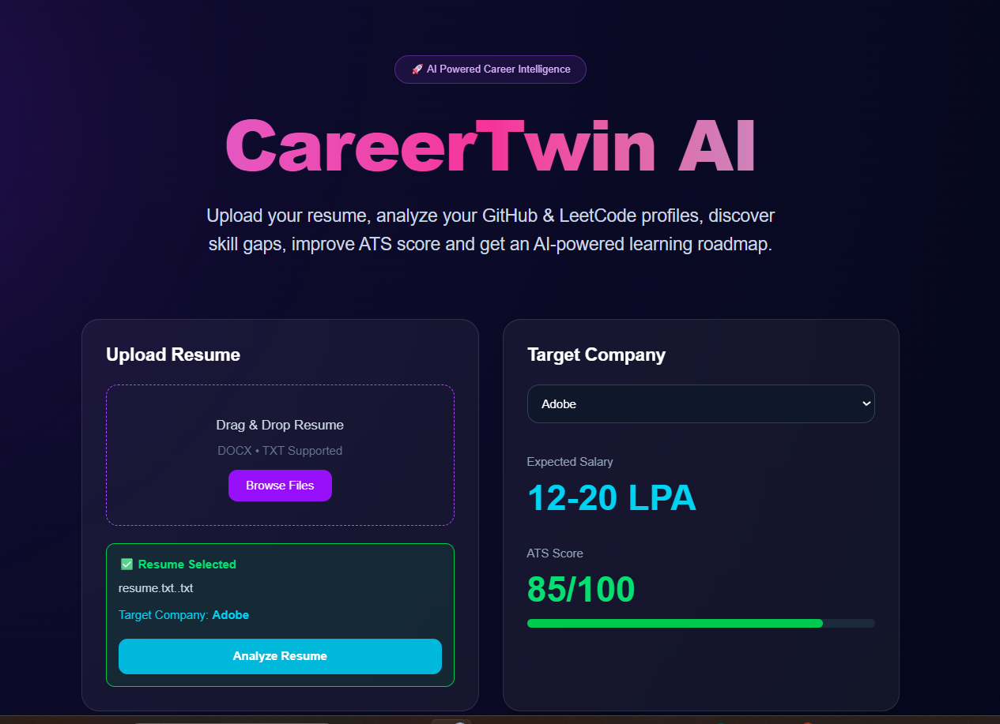
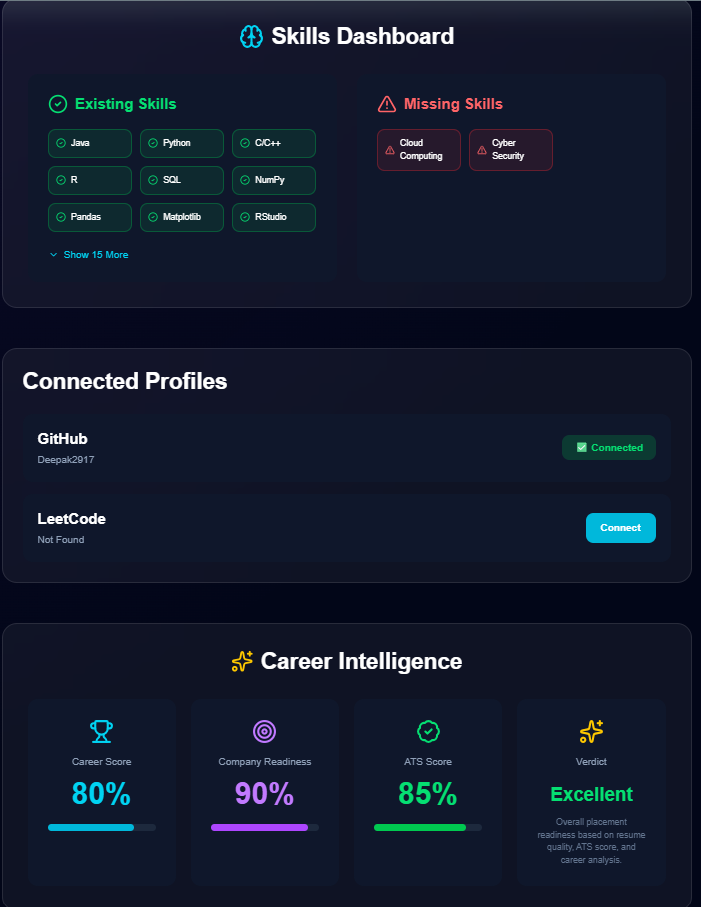
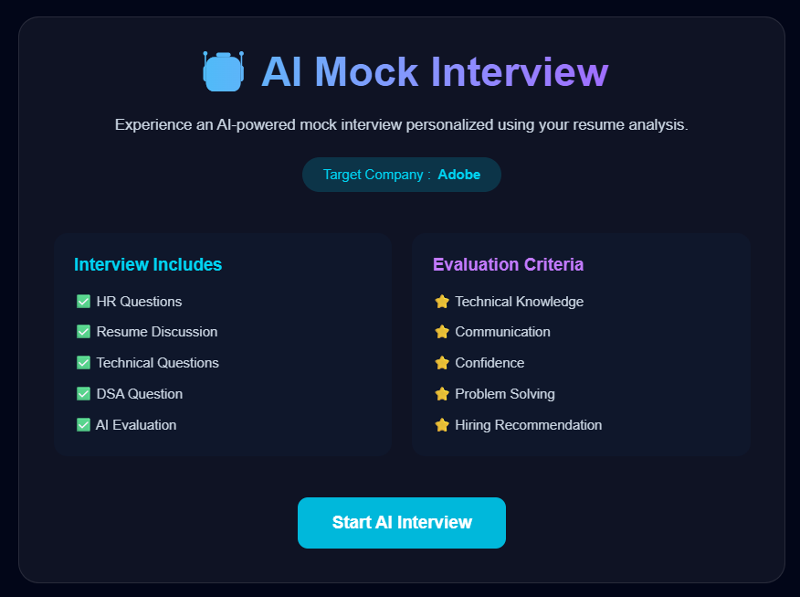
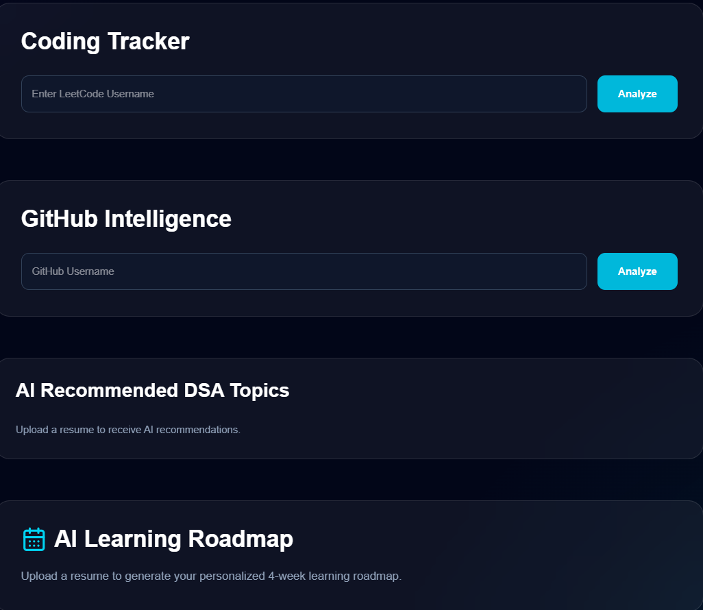

#  CareerTwin AI

> AI-Powered Career Intelligence Platform for Placement Preparation


---

# 🌐 Live Demo

### 🔗 https://career-twin-ai-mocha.vercel.app

---

#  About

CareerTwin AI is an AI-powered placement preparation platform that helps students evaluate their placement readiness using AI.

The platform analyzes resumes, predicts salary ranges, evaluates ATS compatibility, identifies skill gaps, analyzes GitHub profiles, tracks coding progress, generates personalized learning roadmaps, and conducts AI-powered mock interviews.

---

#  Features

###  Resume Analysis

- AI Resume Analysis
- Career Score
- ATS Score
- Placement Probability
- Company Readiness
- Salary Prediction

###  Skill Analysis

- Skill Detection
- Missing Skill Identification
- Career Suggestions
- Personalized Learning Roadmap

### 💻 Coding Profiles

- GitHub Profile Tracking
- LeetCode Username Detection
- DSA Recommendations

### 🤖 AI Mock Interview

- HR Questions
- Resume-Based Questions
- Technical Questions
- DSA Questions
- AI Evaluation
- Interview Score
- Strengths & Weaknesses
- Ideal Answer Suggestions

### 📊 Report Generation

- Download Career Report

---

# Tech Stack

### Frontend

- Next.js
- React
- TypeScript
- Tailwind CSS

### Backend

- Next.js API Routes
- Groq API

### AI Model

- Llama 3.3 70B Versatile

### Deployment

- Vercel

### Version Control

- Git
- GitHub

---

#  Project Structure

```
app/
components/
data/
public/
```

---

#  Installation

Clone the repository

```bash
git clone https://github.com/Deepak2917/CareerTwin-AI.git
```

Go to the project folder

```bash
cd CareerTwin-AI
```

Install dependencies

```bash
npm install
```

Create a `.env.local` file

```env
GROQ_API_KEY=your_groq_api_key
```

Start the development server

```bash
npm run dev
```

Open your browser and visit:

```
http://localhost:3000
```

---

#  Screenshots

## Home Page



---

## Resume Analysis




---

## AI Mock Interview



---

## Coding Tracker & Learning Roadmap



# Future Improvements

- PDF Resume Support
- LinkedIn Profile Analysis
- Voice-based AI Interview
- AI Resume Builder
- Company Interview Database

---

#  Developer

**Deepak Gowda S R**

GitHub:
https://github.com/Deepak2917

LinkedIn:
(Add your LinkedIn profile link here)

---

⭐ If you found this project useful, consider giving it a Star on GitHub.